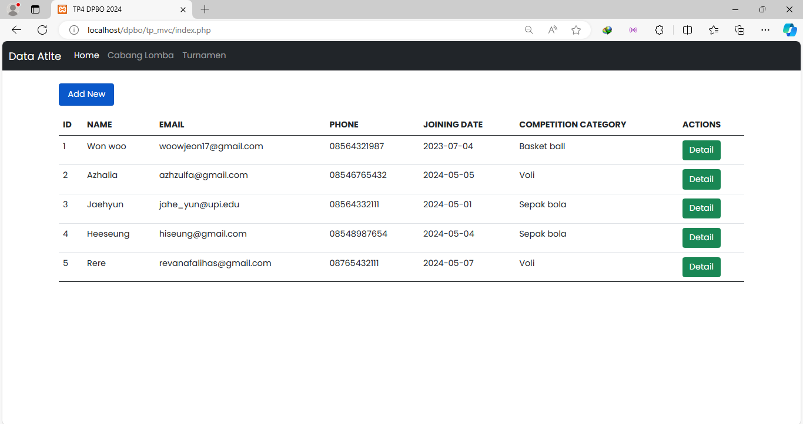
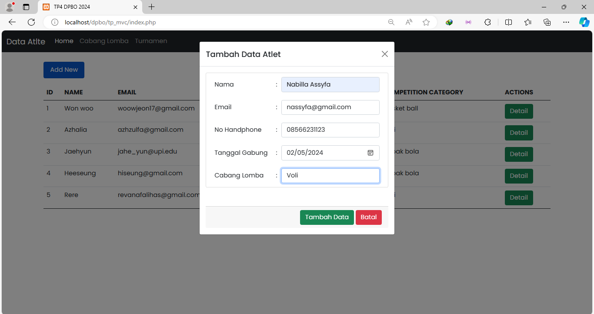
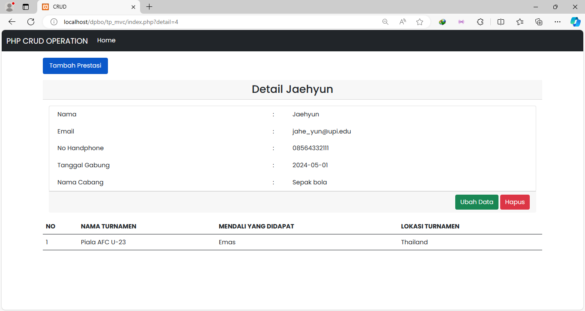

## TP4DPBO2024C2
Saya Nabilla Assyfa Ramadhani [2205297] mengerjakan TP4 dalam mata kuliah Desain dan Pemograman Berorientasi Objek, untuk keberkahanNya maka saya tidak melakukan kecurangan seperti yang telah dispesifikasikan. Aamiin

# Desain Database

Database ini terdiri dari 5 tabel utama : `Members`, `Cabang`, `Turnamen`, `Hasil Lomba` dan `Mendali`.   
- Tabel `members` memiliki hubungan one-to-one dengan tabel `cabang`. Sehingga setiap members memiliki satu cabang lomba yang diikuti.
- Tabel `hasil_lomba` memiliki hubungan one-to-one dengan tabel `turnamen` dan `mendali`. Setiap hasil_lomba memuat data prestasi atlet di satu turnamen dan menghasilkan satu mendali/tidak.
- Tabel `members` memiliki hubungan one-to-many dengan tabel `hasil_lomba`, sehingga satu atlet (members) dapat memiliki beberapa prestasi yang dimuat di tabel `hasil lomba`.

# Desain Program
Program dibuat menggunakan PHP dengan mengimplementasikan MVC (Model, View, Controller). Berikut merupakan komponen - komponen program ini :
1. Models
    - **`DB.class`** : Digunakan untuk menghubungkan dengan database. 
    - **`M_Cabang`** : Digunakan untuk menampung metode-metode untuk mengelola data cabang lomba melalui perintah database.
    - **`M_hasil`** : Digunakan untuk menampung metode-metode untuk mengelola data hasil pertandingan melalui perintah database.
    - **`M_turnamen`** : Digunakan untuk menampung metode-metode untuk mengelola data turnamen melalui perintah database.
    - **`M_members`** : Digunakan untuk menampung metode-metode untuk mengelola data members (atlet) melalui perintah database.
    - **`Template.class`** : Digunakan untuk membaca, menulis dan memanipulasi file teks.
2. Views
    - **`V_cabang`** : Digunakan untuk menampilkan data cabang lomba, serta melakukan proses CRUD.
    - **`V_detail`** : Digunakan untuk menampilkan detail data atlet dan prestasi yang pernah didapat, serta melakukan proses CRUD
    - **`V_members`** : Digunakan untuk menampilkan data atlet, serta melakukan proses Create.
    - **`V_turnamen`** : Digunakan untuk menampilkan data turnamen, serta melakukan proses CRUD.
3. Controller
    - **`C_cabang`** :  Digunakan untuk mengatur dan mengelola data cabang lomba, serta memproses data dari model yang nantinya akan ditampilkan melalui view.
    - **`C_members`** : Digunakan untuk mengatur dan mengelola data members, serta memproses data members dari model seperti proses CRUD yang nantinya akan ditampilkan melalui view.
    - **`C_turnamen`** : Digunakan untuk mengatur dan mengelola data turnamen, serta memproses data dari model yang nantinya akan ditampilkan melalui view.
4. Templates
    - **`T_cabang.html`** : Tampilan html yang digunakan untuk menampilkan data cabang, serta form tambah data.
    - **`T_Update.html`** : Tampilan html yang digunakan untuk menampilkan form update, baik form update member, cabang maupun turnamen.
    - **`T_index.html`** : Tampilan html yang digunakan untuk menampilkan data atlet.
    - **`T_turnamen.html`** : Tampilan html yang digunakan untuk menampilkan data turnamen, serta form tambah data turnamen.
    - **`T_detail.html`** : Tampilan html yang digunakan untuk menampilkan data atlet dan prestasi yang pernah diraih, serta form tambah prestasi atlet tersebut.
5. **`index.php`** : Menampung kondisi-kondisi pada data member yang kemudian akan mengakses controller.
6. **`cabang.php`** : Menampung kondisi-kondisi pada data cabang yang kemudian akan mengakses controller.
7. **`turnamen.php`** : Menampung kondisi-kondisi pada data turnamen yang kemudian akan mengakses controller.
8. **`connection.php`** : Digunakan untuk menyimpan konfigurasi koneksi ke database.

# Alur Program
### Tambah Data
1. Pengguna membuka halaman utama web, saat penguna menekan tombol `add new` , program akan menampilkan formulir penambahan data.
2. Pengguna diminta untuk mengisi field yang tersedia, jika sudah selesai pengguna dapat menekan tombol `tambah`.
3. Data yang telah pengguna isi akan diproses di file `index.php`, yang kemudian akan memanggil controller.
4. Controller akan membuka koneksi ke model untuk terhubung ke database.
5. Controller akan memanggil fungsi `add data` untuk menambahkan data baru kedalam database.
6. Jika penyimpanan data berhasil, maka akan menampilkan konfirmasi bahwa data berhasil ditambah.

### Update Data
1. Ketika pengguna menekan tombol `edit`, program akan menampilkan form edit data.
2. Pengguna dapat melakukan modifikasi pada data yang ingin diubah.
3. Setelah selesai melakukan perubahan, pengguna dapat menekan tombol `ubah`
4. Data yang telah pengguna ubah akan diproses di file `index.php`, yang kemudian akan memanggil controller.
4. Controller akan membuka koneksi ke model untuk terhubung ke database.
5. Controller akan memanggil fungsi `update data` untuk mengubah data.
6. Jika proses ubah data berhasil, maka akan menampilkan konfirmasi bahwa data berhasil diubah.
### Hapus Data
1. Ketika pengguna menekan tombol `hapus`, program akan menampilkan konfirmasi penghapusan data.
2. Jika pengguna mengkonfirmasi penghapusan, data yang akan dihapus di proses di file `index.php`, yang kemudian akan memanggil controller.
3. Controller akan memanggil fungsi `hapus data` untuk menghapus data dari database.
4. Jika proses hapus data berhasil, maka akan menampilkan konfirmasi bahwa data berhasil dihapus.

# Dokumentasi
## Members (Atlet)
#### Menampilkan data

#### Tambah Data

#### Ubah Data

#### Hapus Data

#### Menampilkan detail data atlet

#### Tambah Data prestasi atlet

## Cabang Lomba
#### Menampilkan data

#### Tambah Data

#### Ubah Data

#### Hapus Data

## Turnamen
#### Menampilkan data

#### Tambah Data

#### Ubah Data

#### Hapus Data

